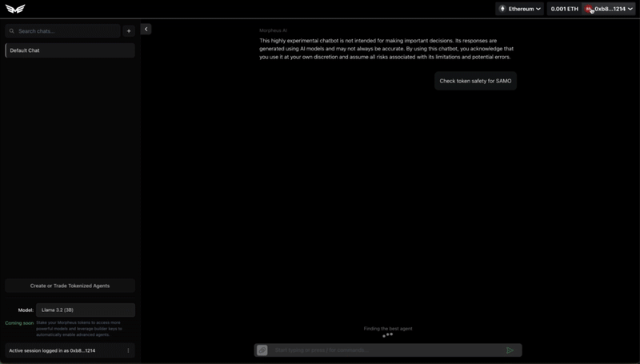

# MySuperAgent

## A Platform for Building, Deploying, and Leveraging AI Agents

A developer-focused platform that enables building, testing, and deploying AI agents. Powered by React and Next.js, with seamless integration of LLMs and Web3 capabilities.

**Note:** MySuperAgent serves as both a development sandbox and production platform for AI agent builders. The platform enables rapid prototyping and deployment of agents that can be automatically invoked based on user intent.



---

### Available Agents & Features

#### Document Analysis 📄

- Upload and analyze documents with natural language querying
- Example: "Summarize the uploaded document"
- Example: "What are the key points in this uploaded document?"

#### Crypto Market Data 📈

- Real-time price, market cap and TVL data
- Example: "What's the price of ETH?"
- Example: "What's the FDV of USDC?"

#### Tweet Generator 🔥

- AI-powered viral tweet generation
- Example: "Create a viral tweet about Web3"
- Example: "Create a spicy crypto market tweet about Gary Gensler"

#### Base Transactions ⚡

- Send and swap tokens on Base
- Example: "Send USDC on Base"
- Example: "Swap USDC for ETH on Base"

#### MOR Rewards Tracking 🏆

- Track and analyze MOR rewards
- Example: "Show my MOR rewards balance"
- Example: "Calculate my pending MOR rewards"

#### Crypto News Analysis 📰

- Get latest crypto market news and analysis
- Example: "Analyze recent crypto market news for ETH"
- Example: "What's the latest news impact on BTC?"

#### DexScreener 📊

- Monitor DEX activity and token metrics
- Example: "Scan Dexscreener for the most active tokens on solana"
- Example: "Show me DEX activity for ETH as reported by Dexscreener"

#### Elfa Social Search 🔍

- Search social media for crypto mentions
- Example: "Search for mentions of MOR on social media"
- Example: "What are the top trending tokens on social media?"

#### Solana Token Safety 🛡️

- Check token safety and rugpull risks
- Example: "Check token safety for SAMO"
- Example: "Show me the most viewed tokens on rugcheck"

#### Codex Agent 🗄️

- Advanced token analytics and insights
- Example: "What are the top trending tokens on Ethereum?"
- Example: "Who are the top holders of $TRUMP on Solana?"

---

## Getting Started

### Using the Platform

Visit [https://mysuperagent.io](https://mysuperagent.io) to access the hosted platform.

#### Requirements

- Modern web browser (Chrome, Firefox, Safari)
- Web3 wallet for blockchain interactions
- API keys for specific agent integrations (Coinbase, Twitter, etc)

### Local Development

To run MySuperAgent locally, follow these comprehensive setup instructions:

#### Prerequisites

- Node.js 18+ and pnpm
- Modern web browser

#### Local Development

1. Clone the repository:

   ```bash
   git clone https://github.com/MorpheusAIs/mysuperagent.git
   cd mysuperagent
   ```

2. Install dependencies and run:

   ```bash
   cd app
   pnpm install
   pnpm run dev
   ```

3. Access the application:
   - Frontend: http://localhost:3000

### Developer Documentation

For developers looking to build and deploy their own agents:

1. [Agent Development Guide](docs/agent-development-guide.md)
2. [API Documentation](docs/available-apis-guide.md)
3. [Testing Framework](docs/testing-framework-guide.md)
4. [Deployment Guide](docs/deployment-guide.md)

# Contributing

See [CONTRIBUTING.md](CONTRIBUTING.md) for guidelines on adding new agents and contributing to the platform.

Your agents will be automatically invoked based on user intent through our advanced routing system.
